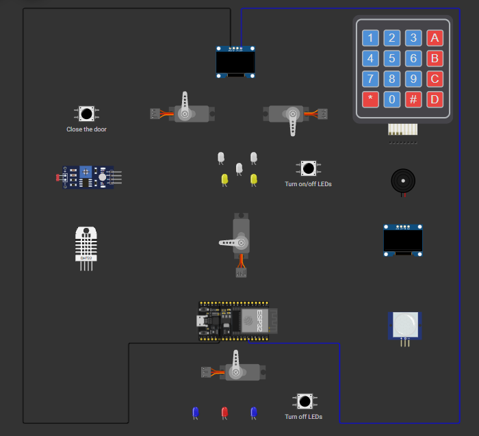

# 🏠 Smart Home System with Security and Web Control

An ESP32-based smart home system developed as a **Microprocessor Course Project**.

The project combines **home security, access control, intelligent lighting, temperature monitoring, motion detection, OLED displays, servo motors, keypad input, and Wi-Fi/web-based control** into a single smart-home simulation.

The complete system was designed and simulated using **ESP32 and Wokwi**.

---

## 🔗 Project Demo

▶️ **[Run the Smart Home Simulation on Wokwi](https://wokwi.com/projects/433567081351992321)**

📄 **[View the Project Documentation](docs/project-report.pdf)**

---

## 📷 Circuit Diagram

The complete circuit is available in the project files and can also be viewed directly in Wokwi.



---

## 📌 Project Overview

The system is designed around two main functions:

* **Smart Security:** Secure access to the house using password authentication, keypad input, servo-controlled doors, and an alarm system.
* **Smart Home Control:** Monitoring and controlling lighting, temperature, ventilation, and yard activity through sensors, actuators, OLED displays, and a web interface.

The ESP32 acts as the main controller and coordinates all sensors, actuators, displays, and communication components.

---

# ✨ Features

## 🔐 Smart Security & Access Control

The security subsystem provides password-based access to the house.

* 4×4 keypad for password entry
* Password status displayed on an OLED screen
* `#` key confirms the entered password
* `*` key clears the current input
* Two servo motors simulate opening and closing the entrance doors
* Indoor lights are activated after successful authentication
* Three consecutive incorrect passwords trigger the security alarm
* The system enters a temporary security lockout after repeated failed attempts
* Security events are reported through the system interface and Serial Monitor

### Security Flow

```text
             System Start
                  │
                  ▼
        Security System Active
                  │
                  ▼
            Enter Password
                  │
           ┌──────┴──────┐
           │             │
        Correct         Wrong
           │             │
           ▼             ▼
       Open Door    Increase Attempts
           │             │
           ▼             ▼
       Lights ON    3 Failed Attempts
           │             │
           ▼             ▼
      Close Door       Alarm
           │             │
           ▼             ▼
   Security Reactivated  Lockout
```

---

## 💡 Intelligent Lighting

The lighting subsystem combines manual control with automatic light adjustment.

* Five LEDs simulate indoor lighting
* Three LEDs simulate yard lighting
* Push buttons provide manual lighting control
* LDR sensor measures ambient light
* Indoor LED brightness is adjusted according to the detected light level
* Yard lights can be controlled according to motion and manual input

---

## 🌡️ Temperature & Fan Control

The temperature subsystem monitors the environment and controls a simulated cooling fan.

* DHT22 sensor measures temperature
* Servo motor simulates the cooling fan
* Fan is activated when the temperature exceeds **30°C**
* Fan operation is divided into:

  * Low temperature range
  * Medium temperature range
  * High temperature range
* Temperature and fan status are displayed on the OLED

---

## 🚶 Motion Detection & Yard Control

The yard subsystem uses a PIR sensor to detect movement.

* PIR sensor detects motion in the yard
* A servo motor simulates the yard door
* Yard lights turn on when motion is detected
* Yard lighting can also be controlled manually
* Yard events are reported through the Serial Monitor

---

## 🖥️ OLED Monitoring & Keypad Menu

Two OLED displays are used for different purposes.

### Security OLED

Displays information related to:

* Password entry
* Authentication status
* Security messages
* Alarm and lockout information

### Home Status OLED

Displays information such as:

* Door status
* LDR/light level
* Temperature
* Fan status
* PIR motion status

The keypad also provides an interactive menu for accessing:

* Home Status
* Light Control
* Fan Information
* Burglar Alarm

---

## 🌐 Wi-Fi & Web Interface

The ESP32 provides Wi-Fi connectivity and a web-based smart-home control interface.

The web interface is designed to provide:

* Login/password interface
* Smart-home dashboard
* Door control
* Indoor light control
* Yard light control
* Fan control
* Real-time system status

This allows the smart-home system to be monitored and controlled remotely through a web browser.

---

# 🧩 Hardware Components

| Component    | Quantity | Purpose                                      |
| ------------ | -------: | -------------------------------------------- |
| ESP32        |        1 | Main microcontroller and Wi-Fi communication |
| OLED Display |        2 | Security and home-status monitoring          |
| 4×4 Keypad   |        1 | Password and menu input                      |
| DHT22        |        1 | Temperature measurement                      |
| LDR          |        1 | Ambient light measurement                    |
| PIR Sensor   |        1 | Motion detection                             |
| Servo Motor  |        4 | Door and fan simulation                      |
| Buzzer       |        1 | Security alarm                               |
| Indoor LEDs  |        5 | Indoor lighting simulation                   |
| Yard LEDs    |        3 | Yard lighting simulation                     |
| Push Buttons | Multiple | Manual control                               |
| Resistors    | Multiple | Circuit components                           |

---

# 🛠️ Software & Technologies

* **ESP32**
* **C/C++**
* **Arduino Framework**
* **FreeRTOS**
* **Wi-Fi**
* **Web Server**
* **HTML / CSS / JavaScript**
* **Wokwi Simulator**
* **PlatformIO**

### Libraries

* Adafruit SSD1306
* Adafruit GFX
* DHT Sensor Library
* Keypad
* ESP32Servo

---

# ⚙️ System Architecture

The project is organized into multiple functional tasks so that different parts of the smart-home system can operate independently.

The main tasks include:

```text
                    ESP32
                      │
       ┌──────────────┼──────────────┐
       │              │              │
       ▼              ▼              ▼
   Security       Environment     Web Server
       │              │              │
       ▼              ▼              ▼
   Keypad          DHT22           Wi-Fi
   OLED            LDR             Dashboard
   Servos          PIR             Controls
   Buzzer          LEDs
       │              │
       └──────────────┘
              │
              ▼
        Smart Home System
```

The task-based architecture allows security, environmental monitoring, lighting, display updates, and web communication to run as separate parts of the system.

---

# 📁 Project Structure

```text
Smart-Home-ESP32/
│
├── README.md
├── diagram.json
├── platformio.ini
├── wokwi.toml
│
├── include/
│   └── README
│
├── lib/
│   └── README
│
├── src/
│   └── main.cpp
│
├── test/
│   └── README
│
└── docs/
    ├── circut.png
    └── project-report.pdf
```

### Main Files

| File / Folder             | Description                               |
| ------------------------- | ----------------------------------------- |
| `src/main.cpp`            | Main source code of the smart-home system |
| `diagram.json`            | Wokwi circuit and component configuration |
| `platformio.ini`          | PlatformIO project configuration          |
| `wokwi.toml`              | Wokwi simulation configuration            |
| `docs/circut.png`         | Circuit diagram image                     |
| `docs/project-report.pdf` | Complete project documentation            |
| `include/`                | Project header files                      |
| `lib/`                    | Project-specific libraries                |
| `test/`                   | Testing-related files                     |

---

# ▶️ How to Run

## Using Wokwi

The easiest way to test the project is through Wokwi.

1. Open the **[Wokwi Simulation](https://wokwi.com/projects/433567081351992321)**.
2. Start the simulation.
3. Interact with the keypad, buttons, sensors, and web interface.
4. Observe the system status through the OLED displays and Serial Monitor.

## Using PlatformIO

The project can also be opened and built using **VS Code + PlatformIO**.

```text
1. Clone the repository
2. Open the project in VS Code
3. Install PlatformIO
4. Build the project
5. Upload it to an ESP32 board
```

---

# 📚 Documentation

The complete documentation, including the project description, circuit information, implementation details, and project analysis is available here:

📄 **[Project Documentation](docs/project-report.pdf)**

---

# 🎓 Academic Information

**Course:** Microprocessor
**Platform:** ESP32 + Wokwi
**Framework:** Arduino / PlatformIO
**Academic Year:** Summer 2025 (1404)

---

# 👩‍💻 Author

### Nazanin Niazi

**B.Sc. Computer Engineering — Persian Gulf University**

* GitHub: [NazaninNiazi](https://github.com/NazaninNiazi)
* LinkedIn: [Nazanin Niazi](https://www.linkedin.com/in/nazanin-niazi/)

---

## 📌 Project Highlights

This project demonstrates practical experience with:

**Embedded Systems · ESP32 · C/C++ · IoT · Wi-Fi · Web Control · Sensors · Actuators · FreeRTOS · OLED · Keypad · PlatformIO · Wokwi**
